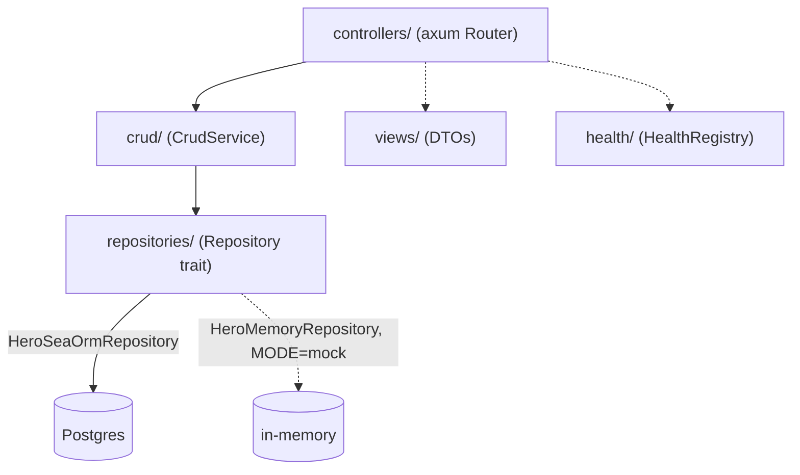

# 0001. Use an MVC-ish layering with a generic CRUD interface, backed by a storage-agnostic repository

## Status

Accepted

## Context

Phase 2 needed a concrete database-backed resource (Hero), a persistence
layer against Postgres, and a repeatable pattern: a template's job is to
make the *next* resource cheap to add, not just to demonstrate one. This
mirrors template-fastapi's own `docs/adrs/0001` verbatim in its reasoning,
translated into this instance's own Rust/SeaORM/axum choices.

Two designs were on the table. The first: one hand-written CRUD module per
resource, built directly against that resource's SeaORM entity and DTOs —
simple to read, but every new resource duplicates the same five operations
with only the types changed. The second: a generic CRUD service,
parameterized by a storage-agnostic repository trait, so a new resource
needs a model, DTOs, one small repository `impl` per backend, and a thin
router — no new CRUD logic. The second was chosen deliberately over
`CLAUDE.md`'s usual "three similar lines is better than a premature
abstraction" default, for the same reason template-fastapi's ADR gives: a
*template's* purpose is specifically to make the *n+1*th resource cheap;
that argument doesn't hold for a one-off app.

Rust's static type system changes how far the abstraction can go, though.
Python's `SQLAlchemyRepository` is generic over *any* mapped model at
runtime, because SQLAlchemy's `Base.registry` and Python's dynamic
attribute access let one class introspect an arbitrary model's columns.
SeaORM's `EntityTrait` is generated per entity at compile time; a single
Rust `impl` cannot be generic over "any SeaORM entity" without unwieldy
trait-bound machinery (and even then, column-name string lookups would
throw away the compile-time safety SeaORM exists to provide).

## Decision

We lay `src/` out as an MVC-ish split — `models/` (SeaORM entities),
`views/` (DTOs), `controllers/` (axum routers) — plus two supporting
layers: `repositories/` (a storage-agnostic `Repository` trait, generic
via **associated types** `Model`/`Create`/`Update` rather than "any
entity") and `crud/` (`CrudService<R>`, generic over any `R: Repository`).
`CrudService` never imports a specific model type — `src/crud/mod.rs` has
no resource-specific code at all. Adding a resource means: a SeaORM entity
in `models/`, DTOs in `views/`, one `Repository` `impl` per backend
(SeaORM-backed, in-memory) in `repositories/`, and a router in
`controllers/` that builds a `CrudService::new(repository)` — see
`src/repositories/mod.rs`'s module doc for the exact shape.

We enforce a strict, one-directional module import order (`config` →
`oidc` → `models` → `views` → `repositories` → `crud` → `health` →
`controllers` → `main`) -- see ADR 0009 for how that's enforced.

We apply the same "storage-agnostic interface, one concrete
implementation per backend" shape to health checks (`health::HealthCheck`
is a trait; any external dependency implements it and registers with
`HealthRegistry`, which `/health/ready` runs concurrently) -- see ADR
0007's corresponding python decision, ported without a dedicated ADR here
since it's a smaller-scope repeat of this same idea.

## Consequences

Adding a new CRUD resource is three small, mechanical pieces instead of a
bespoke service — the intended payoff. The cost is one extra level of
indirection (controller → `CrudService` → `Repository` → SeaORM/memory)
to read any single resource's data flow, same trade template-fastapi's
own ADR accepts.

The Rust-specific cost, beyond that: `Repository`'s associated types mean
`CrudService<R>` is generic over exactly one `(Model, Create, Update)`
triple per `R`, not truly "any model" the way Python's protocol is. A
resource's SeaORM `impl Repository for HeroSeaOrmRepository` still
contains its own column-mapping code (`src/repositories/hero_sea_orm.rs`)
— that entity-specific work that Python's dynamic ORM avoids is
unavoidable here without giving up SeaORM's compile-time column safety.
`CrudService` itself, though, stays exactly as generic as the Python
`CRUDInterface` — zero resource-specific code, satisfied by construction
(the compiler rejects a `CrudService<R>` method that references a
concrete field name).

Storing "the current backend" behind one field on `AppState` needed a
boxed trait object (`Box<dyn Repository<Model=..., Create=..., Update=...>>`);
a generic blanket `impl<M,C,U> Repository for Box<dyn Repository<...>>`
hits a known async-trait/higher-ranked-trait-bound limitation ("`Repository`
is not general enough"), so `src/repositories/mod.rs` provides a
`dyn_repository!` macro that generates one concrete, monomorphic wrapper
type per resource instead. This is more boilerplate than Python needed,
documented here rather than worked around silently.
