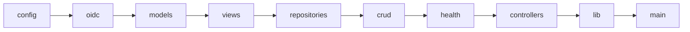
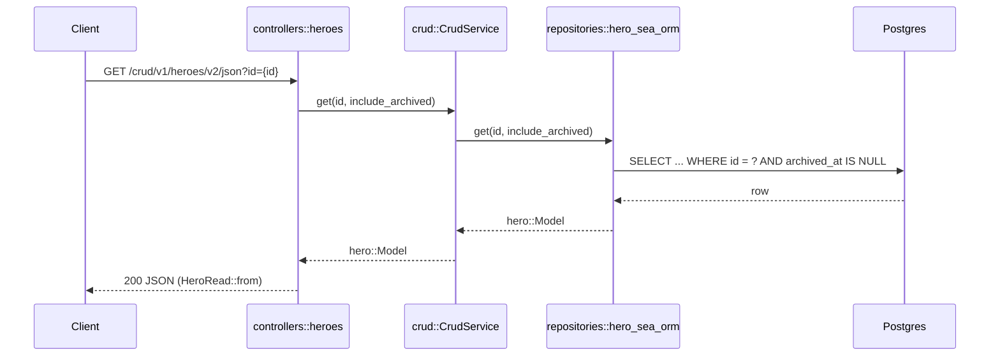

# src/

The axum application, laid out as an MVC-ish split across submodules,
each with its own `README.md`:

- `models/` — the Model layer: SeaORM entities, plus `HasId` (a model
  with a stable integer identity, used by `controllers::crud_actions`).
- `views/` — the View layer: request/response DTOs, plus `bulk` (the
  resource-agnostic `BulkUpdateResult`/`BulkDeleteResult` shapes).
- `controllers/` — the Controller layer: axum routers, shared
  `AppState`, RBAC role constants.
- `repositories/` — storage-agnostic CRUD access, backing `crud/`.
- `crud/` — the generic CRUD service built from a `Repository`.
- `health/` — the health-check trait and registry backing
  `controllers::health`.
- `oidc/` — provider-agnostic OIDC bearer-token validation plus
  Keycloak client-role RBAC.
- `migration/` — SeaORM migrations, applied automatically at startup.

`config.rs`/`lib.rs`/`main.rs`/`telemetry.rs`/`problem_details.rs`/
`rate_limit.rs`/`events.rs`/`http_headers.rs` stay flat, outside any
submodule — each has no resource-specific code and no state of its own
beyond what it's explicitly passed or reads from `config::Settings`.

- `config.rs` — settings, read from environment variables only; see
  "Configuration" and "MODE" below.
- `lib.rs` — the crate's library target: every module declaration plus
  the wiring (`build_state`, `build_router`, `build_event_bus`,
  `build_health_registry`, `run_migrations`). See "Library and binary"
  below.
- `main.rs` — process entry point, deliberately thin: it only reads
  settings and calls `lib.rs`'s wiring.
- `telemetry.rs` — structured JSON logging setup; see "Structured
  logging" below.
- `problem_details.rs` — the single `AppError` type and its RFC 9457
  `IntoResponse` impl; see "RFC 9457 error responses" below.
- `rate_limit.rs` — `RateLimiter`, the Redis-backed (in-memory under
  `Mode::Mock`) per-caller rate limiter checked inline by Hero's
  create/update/delete handlers and `POST /mock/token`; see
  `docs/adrs/0011`.
- `events.rs` — `EventBus`/`EventStream`, the MQTT-backed (in-memory
  `tokio::sync::broadcast` fan-out under `Mode::Mock`) publish/subscribe
  behind `GET <prefix>/events`; see "CRUD event stream" below and
  `docs/adrs/0016`.
- `http_headers.rs` — `Sunset`, an `IntoResponseParts` type a handler
  combines into its return value to attach RFC 8594 `Sunset`/
  `Deprecation`/`Link` headers; not yet used by any route (see
  `docs/adrs/0012`).

## Library and binary

This package builds both a `[lib]` (`lib.rs`, crate name
`template_axum`) and a `[[bin]]` (`main.rs`). The split exists so
`tests/`' integration tier can link against the crate's public API and
build the *same* router the binary serves, rather than a test-only
lookalike — Cargo integration tests cannot reach into a bin-only crate
at all. See `docs/adrs/0016` and `tests/README.md`.

Practical consequence: everything a test or the binary needs is `pub`
from `lib.rs`, and `main.rs` refers to it as `template_axum::...`, not
`crate::...`.

## CRUD event stream

`GET /crud/v1/heroes/v2/json/events` is a Server-Sent Events stream of
Hero create/update/delete activity (FR-0030). `controllers::crud_events`
holds the resource-agnostic half (subscriber-id resolution, frame shape,
the publish helper); `events.rs` holds the transport.

The delivery guarantee is narrow and deliberate: a subscriber that
reconnects with the same `subscriber_id` gets everything published while
it was away, because that id *is* the client id of a persistent,
QoS-1 MQTT session. A client that discards it gets no replay, silently.
`Mode::Mock` has no broker and no replay at all. `docs/adrs/0016`,
`docs/nfrs/NFR-0029` and `events.rs`'s module doc all state this; don't
paraphrase it into something broader.

A mutating handler announces its own event inline (`crud_events::
publish`) the way it checks its own rate limit — `crud::CrudService`
stays free of infrastructure concerns (NFR-0004). Publishing never fails
the request that triggered it.

## Layering

Import order between all of the above is strict and one-directional —
lower layers never import from higher ones: `config` → `oidc` →
`models` → `views` → `repositories` → `crud` → `health` →
`controllers` → `lib`/`main`. See `docs/adrs/0009-strict-module-layering-by-
convention-and-visibility.md` for how this is enforced (by convention
plus each module's own doc comment, not an automated lint — a
documented gap against the stricter enforcement template-fastapi's
`import-linter` provides).

An arrow means "may import from" — each module may depend on anything
to its left, never anything to its right.

## Configuration

No application `.env` file: `config.rs` reads settings from the process
environment only. `Settings::from_env` composes `DATABASE_URL` from the
individual `POSTGRES_*` pieces (unless `DATABASE_URL` is set directly),
and reads `RUSTFS_ACCESS_KEY`/`RUSTFS_SECRET_KEY` (falling back to
`S3_ACCESS_KEY`/`S3_SECRET_KEY`) the same way `config.py` does in the
reference implementation. `Mode::Production` additionally refuses to
construct `Settings` at all if a credential is left at its local
default, a connection scheme is plaintext, or `OIDC_AUDIENCE` is unset
— see `src/config.rs`'s own doc comments and its test suite.

## Migrations

Pending SeaORM migrations apply automatically: `main()` calls
`migration::Migrator::up` once, before `axum::serve` starts, off any
per-request path — but only when `Mode != Mock` (there is no database to
migrate under `Mode::Mock`; see `repositories::hero_memory`). This
happens unconditionally on every real process start (there is no
separate "apply migrations" step to remember) — verified against a real
ephemeral Postgres instance in phase 2's own smoke test.

## OIDC / auth

`oidc::OidcVerifier` validates bearer tokens against
`Settings::oidc_issuer_url` via generic OIDC discovery + JWKS, with no
Keycloak-specific code in the verification path itself — any
Authorization Code + PKCE provider works by pointing `OIDC_ISSUER_URL`
elsewhere. Add auth to a route by taking `oidc::AuthClaims` as a handler
parameter; a handler with no such parameter stays public.

### RBAC

`Claims::require_any_role(client_id, roles)` reads
`resource_access.<client_id>.roles` — Keycloak's client-role claim
shape specifically, not something assumed present on every provider's
token (see `oidc/mod.rs`'s module doc). Gate a route by calling it at
the top of the handler body: `claims.require_any_role(&state.settings.
oidc_client_id, SOME_ROLE_SET)?`.

## MODE (dev / mock / production)

`config::Mode` (env var `MODE`) is `dev`, `mock`, or `production`, read
once in `main()`.

- `dev` (default): real Postgres/Redis/S3/OIDC/MQTT backends.
- `mock`: every external service is replaced with a local fake — the
  in-memory Hero repository, always-healthy mock health checks, an
  in-memory event bus, and unverified bearer-token trust — so the app
  needs zero containers to boot. Requires `ALLOW_MOCK_MODE=1` (`Settings::allow_mock_mode`), so
  this mode can never be reached by `MODE`'s own default/typo alone.
  `POST /mock/token` (`controllers::mock`, mounted only in this mode)
  mints a Keycloak-shaped token so RBAC is exercisable without
  Keycloak.
- `production`: the same real backends as `dev`, plus `Settings::
  from_env`'s stricter validation (see "Configuration" above).

## Structured logging

`telemetry::configure_logging` (called once, first thing in `main()`)
attaches a JSON-formatting `tracing_subscriber` to every `tracing` call
— every log line, including `tower_http::trace::TraceLayer`'s own HTTP
request logs, is one JSON object per line. Level is controlled by
`RUST_LOG`, defaulting to `info`. No OTLP export in this phase (see ADR
0006).

## RFC 9457 error responses

`problem_details::AppError` is the one error type every controller
returns; its `IntoResponse` impl builds the `application/problem+json`
body — no handler builds its own error JSON. A handler that wants a
specific message returns `Err(AppError::NotFound("...".into()))` (or the
matching variant) directly. `AppError::Internal`'s detail is redacted to
a fixed string outside `Mode::Dev` (`configure_detail_redaction`, called
once in `main()`) — the real error always goes to `tracing::error!`
first.

## Example CRUD resource: Hero

`models::hero` / `views::hero` / `repositories::{hero_sea_orm,
hero_memory}` / `controllers::heroes` are the worked example of the
generic CRUD layer (`crud::CrudService`), wired up as
`/crud/v1/heroes/v2/json` (list/get/create/update/delete, plus
filtering/sorting on list and a bulk update/delete form — `docs/adrs/
0013`) and its XML sibling, `controllers::heroes_xml` at
`/crud/v1/heroes/v2/xml` (`docs/adrs/0014`), sharing the same
`CrudService`/repository dependency. Adding another resource follows
the same shape: a SeaORM entity
in `models/` (implementing `HasId`), DTOs in `views/`, one `Repository`
`impl` per backend in `repositories/` (or `crate::dyn_repository!` plus
two small `impl`s, if `MODE=mock` needs a fake — each mapping
`repositories::filtering::FilterClause`/`SortClause` onto its own
storage), a `FIELD_SPECS` table for `controllers::crud_query`, and a
router in `controllers/` built from `crud::CrudService::new(repository)`
plus `controllers::crud_actions`'s shared resolve functions.

Under `MODE=mock`, `Repo`/`DB` are replaced by
`repositories::hero_memory::HeroMemoryRepository`, with no other layer
changing.

Hero also demonstrates `interfaces`-equivalent owner scoping
(`docs/adrs/0007`: reads open to every authenticated caller, writes
restricted to the caller's own `sub`) and soft delete via an
`archived_at` marker column (`docs/adrs/0008`).

## Do

- Add a new setting as a typed field on `Settings` in `config.rs`.
- Add auth to a new route by taking `oidc::AuthClaims` as a handler
  parameter — a handler with no such parameter is public.
- Register a new external service's health check with
  `HealthRegistry::register` in `lib.rs::build_health_registry`.
- Give a new resource an event stream by adding one `/events` route and
  one resource-name constant — `controllers::crud_events` is generic.

## Don't

- Read from a `.env` file, or add one back.
- Hardcode a real secret's value here.
- Assume a claim beyond `sub` is present on every provider's tokens.
- Import "up" the layering described above (e.g. `models/` importing
  from `controllers/`).
